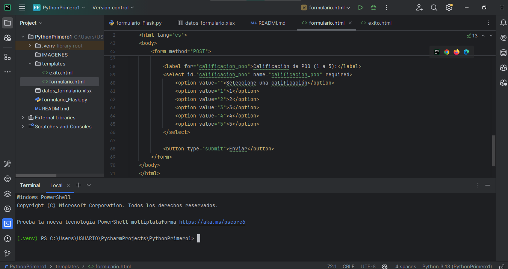

## FORMULARIO

```
# Formulario Flask con Exportación a Excel

Este proyecto es una aplicación web simple construida con Flask que permite a los usuarios enviar un formulario y recopilar sus respuestas en un archivo Excel. Los datos ingresados se almacenan en un archivo `datos_formulario.xlsx`, que se puede descargar después de enviar el formulario.

## Características

- Formulario de registro con campos para nombre, email, ciudad, opinión sobre la Programación Orientada a Objetos y calificación.
- Almacenamiento de datos en un archivo Excel.
- Opción para descargar el archivo Excel con todos los datos recopilados.

## Requisitos

- Python 3.x
- Flask
- Pandas
- Openpyxl

## Instalación

1. Clona este repositorio o descarga los archivos del proyecto.
2. Navega a la carpeta del proyecto en tu terminal.
3. Crea un entorno virtual (opcional pero recomendado):

   ```bash
   python -m venv .venv
```
## CAPTURA DE PANTALLA DEL CODIGO Y FORMULARIO





